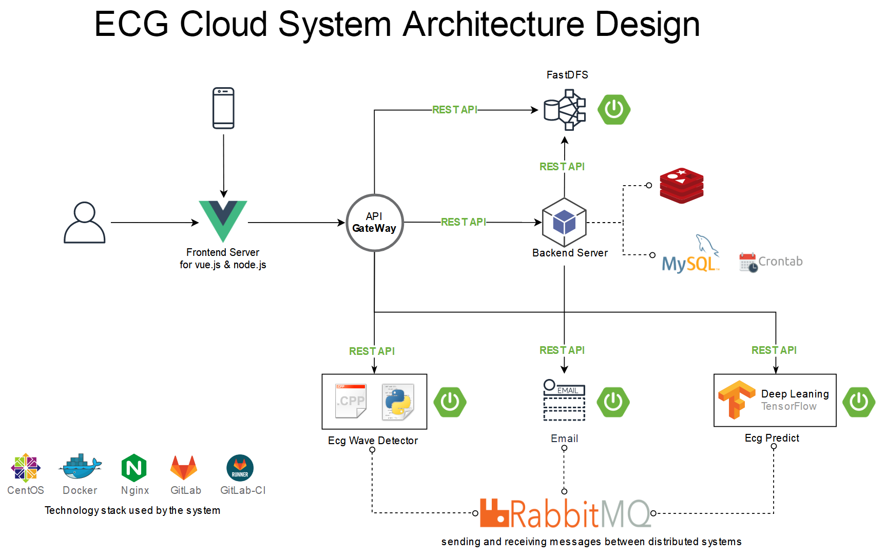
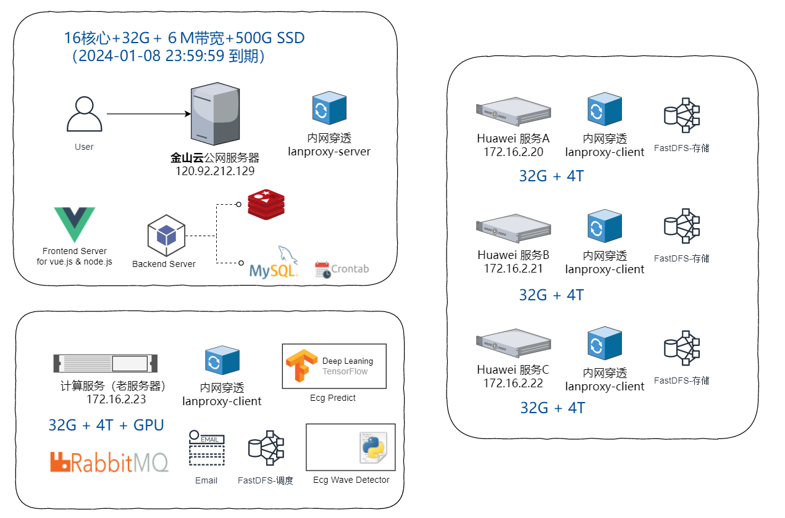
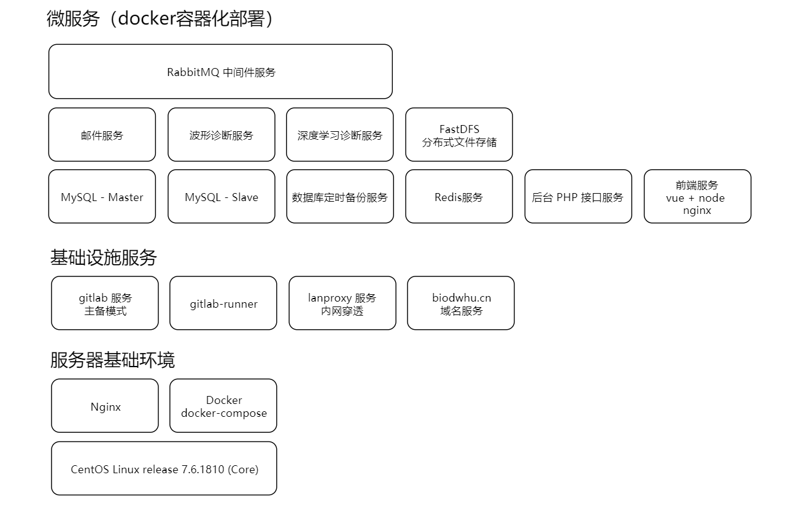

# ECG Cloud

## 一、心电平台服务

### 前台交互

- 多文件上传优化
- 压缩包上传解压优化

### 后台接口

- 心电平台接口实现

### 运维平台（性能监控）

- 数据库定时备份迁移
- 数据库文件大小监控
- 内存、磁盘、CPU 监控
- Nginx 访问日志记录

## 二、独立于平台的模块

### instant-msg-cloud 消息通信平台

- 邮件服务
- ... （短信通知，微信通知）

### ai-cloud 算法模型平台

> 集成所有所有算法，深度学习，机器学习

biodwhu/fastdfs-cloud: distributed file storage, financial-grade data storage service
https://github.com/biodwhu/fastdfs-cloud

### fastdfs-cloud 分布式文件存储平台

> 分布式文件存储服务

biodwhu/ai-cloud: biod lab,whu. biomedical artificial intelligence cloud
https://github.com/biodwhu/ai-cloud

